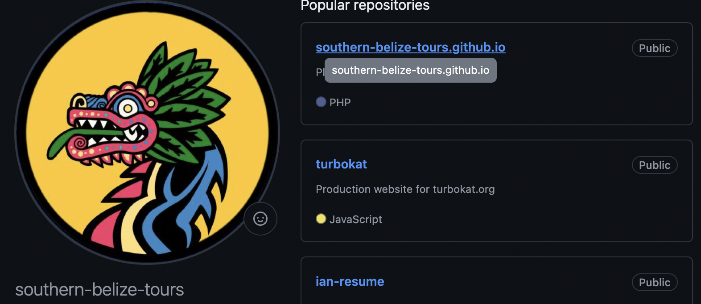

# 🤖 AIML
Public Repo of AI/ML projects, Kaggle Competitions, and self-learning undertaken

## Summary
The work done in this repository is exclusively authored by Ian Feekes, who can be contacted via the following:
* 📧 Email: ianfeekes@gmail.com
* 💻 [Github](github.com/southern-belize-tours) *


* 🙋‍♂️ [Linkedin](https://linkedin.com/in/ianfeekes)


<div style="font-size: 10px">* ℹ️ This is for work done for my tour websites <a href="https://southernbelizetours.com">southernbelizetours.com</a> and <a href="https://cave-tubing.net">cave-tubing.net</a></div>

## Directories
### 📚 Courses
This directory contains work done to continue my education in AI/ML and Data Science, primarily through IBM Learning and Harvard courses.

### 🪿 Kaggle
This directory contains projects done through kaggle competitions, playgrounds, and public datasets. See the README within that ```kaggle``` for more information.