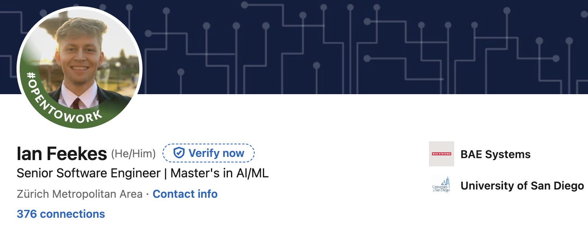

# 🤖 AIML
Public Repo of AI/ML projects, Kaggle Competitions, and self-learning undertaken

## Summary
The work done in this repository is exclusively authored by Ian Feekes, who can be contacted via the following:
* 📧 Email: ianfeekes@gmail.com
* 🙋‍♂️ Linkedin: https://linkedin.com/in/ianfeekes



## Directories
### 📚 Courses
This directory contains work done to continue my education in AI/ML and Data Science, primarily through IBM Learning and Harvard courses.

### 🪿 Kaggle
This directory contains projects done through kaggle competitions, playgrounds, and public datasets. See the README within that ```kaggle``` for more information.