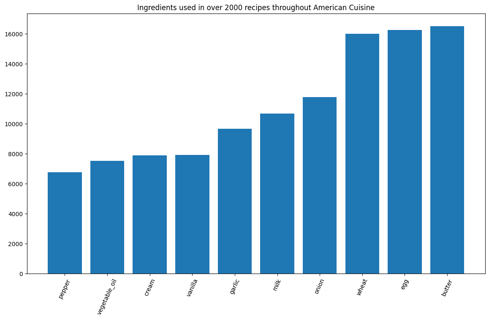
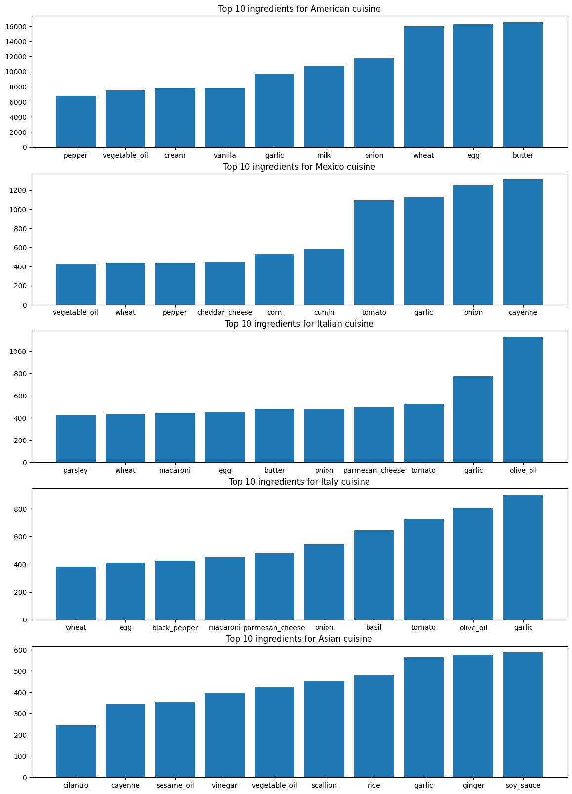
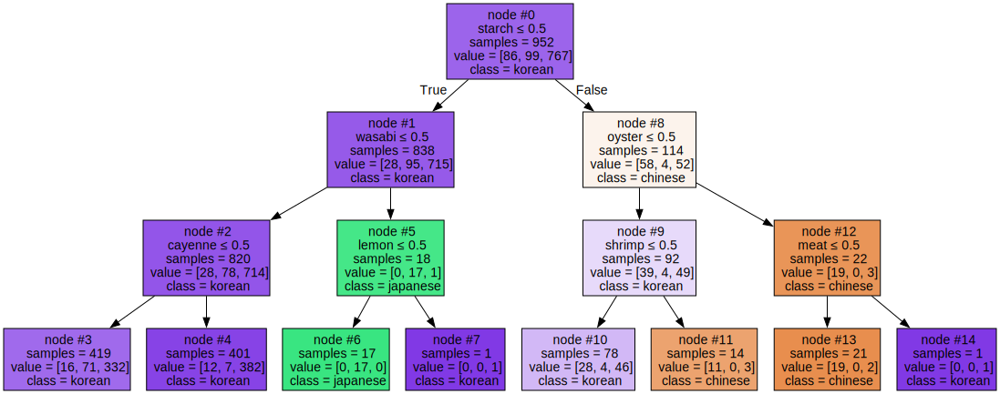

# Data Science Methodology Notes

## Data Preparation

* Removing unwanted elements is often necessary.
* Often records will need to be aggregated e.g. patients need to have data for their health records, financial records, etc.
* Obtaining literary review for factors related to the target variable is most often a big part of the iterative cycle.

The data will eventually be best-used if emerged into a single table.

## 🧪 Case Study Lab

The data for this lab can be found [here](https://cf-courses-data.s3.us.cloud-object-storage.appdomain.cloud/IBMDeveloperSkillsNetwork-DS0103EN-SkillsNetwork/labs/Module%202/recipes.csv)

#### Imports


```python
import pandas as pd
import numpy as np
import matplotlib.pyplot as plt
```


```python
df = pd.read_csv('./recipes.csv')
df.shape
```


    (57691, 384)


```python
df.head()
```


<div>
<style scoped>
    .dataframe tbody tr th:only-of-type {
        vertical-align: middle;
    }

    .dataframe tbody tr th {
        vertical-align: top;
    }

    .dataframe thead th {
        text-align: right;
    }
</style>
<table border="1" class="dataframe">
  <thead>
    <tr style="text-align: right;">
      <th></th>
      <th>country</th>
      <th>almond</th>
      <th>angelica</th>
      <th>anise</th>
      <th>anise_seed</th>
      <th>apple</th>
      <th>apple_brandy</th>
      <th>apricot</th>
      <th>armagnac</th>
      <th>artemisia</th>
      <th>...</th>
      <th>whiskey</th>
      <th>white_bread</th>
      <th>white_wine</th>
      <th>whole_grain_wheat_flour</th>
      <th>wine</th>
      <th>wood</th>
      <th>yam</th>
      <th>yeast</th>
      <th>yogurt</th>
      <th>zucchini</th>
    </tr>
  </thead>
  <tbody>
    <tr>
      <th>0</th>
      <td>Vietnamese</td>
      <td>No</td>
      <td>No</td>
      <td>No</td>
      <td>No</td>
      <td>No</td>
      <td>No</td>
      <td>No</td>
      <td>No</td>
      <td>No</td>
      <td>...</td>
      <td>No</td>
      <td>No</td>
      <td>No</td>
      <td>No</td>
      <td>No</td>
      <td>No</td>
      <td>No</td>
      <td>No</td>
      <td>No</td>
      <td>No</td>
    </tr>
    <tr>
      <th>1</th>
      <td>Vietnamese</td>
      <td>No</td>
      <td>No</td>
      <td>No</td>
      <td>No</td>
      <td>No</td>
      <td>No</td>
      <td>No</td>
      <td>No</td>
      <td>No</td>
      <td>...</td>
      <td>No</td>
      <td>No</td>
      <td>No</td>
      <td>No</td>
      <td>No</td>
      <td>No</td>
      <td>No</td>
      <td>No</td>
      <td>No</td>
      <td>No</td>
    </tr>
    <tr>
      <th>2</th>
      <td>Vietnamese</td>
      <td>No</td>
      <td>No</td>
      <td>No</td>
      <td>No</td>
      <td>No</td>
      <td>No</td>
      <td>No</td>
      <td>No</td>
      <td>No</td>
      <td>...</td>
      <td>No</td>
      <td>No</td>
      <td>No</td>
      <td>No</td>
      <td>No</td>
      <td>No</td>
      <td>No</td>
      <td>No</td>
      <td>No</td>
      <td>No</td>
    </tr>
    <tr>
      <th>3</th>
      <td>Vietnamese</td>
      <td>No</td>
      <td>No</td>
      <td>No</td>
      <td>No</td>
      <td>No</td>
      <td>No</td>
      <td>No</td>
      <td>No</td>
      <td>No</td>
      <td>...</td>
      <td>No</td>
      <td>No</td>
      <td>No</td>
      <td>No</td>
      <td>No</td>
      <td>No</td>
      <td>No</td>
      <td>No</td>
      <td>No</td>
      <td>No</td>
    </tr>
    <tr>
      <th>4</th>
      <td>Vietnamese</td>
      <td>No</td>
      <td>No</td>
      <td>No</td>
      <td>No</td>
      <td>No</td>
      <td>No</td>
      <td>No</td>
      <td>No</td>
      <td>No</td>
      <td>...</td>
      <td>No</td>
      <td>No</td>
      <td>No</td>
      <td>No</td>
      <td>No</td>
      <td>No</td>
      <td>No</td>
      <td>No</td>
      <td>No</td>
      <td>No</td>
    </tr>
  </tbody>
</table>
<p>5 rows × 384 columns</p>
</div>


### Japanese Recipe?

Let's say we want to make sushi. This contains:
* rice
* soy sauce
* wasabi
* fish/vegetables


```python
'rice' in df.columns, 'soy_sauce' in df.columns, 'wasabi' in df.columns, 'fish' in df.columns
```


    (True, True, True, True)


So a naive approach to classifying a recipe as japanese is by saying it contains sushi ingredients

Note that instead of 'True' 'False' the columns are all strings 'Yes', 'No'


```python
df['almond'].value_counts()
```


    almond
    No     55362
    Yes     2329
    Name: count, dtype: int64


But if we filter based on this naiive approach we can see this is untrue: other `asian` cuisines have these ingredients, and even an `american` cuisine has a recipe including these ingredients.


```python
sushi_columns = ['rice', 'soy_sauce', 'wasabi', 'fish']
df[(df[sushi_columns] == 'Yes').all(axis=1)]
```


<div>
<style scoped>
    .dataframe tbody tr th:only-of-type {
        vertical-align: middle;
    }

    .dataframe tbody tr th {
        vertical-align: top;
    }

    .dataframe thead th {
        text-align: right;
    }
</style>
<table border="1" class="dataframe">
  <thead>
    <tr style="text-align: right;">
      <th></th>
      <th>country</th>
      <th>almond</th>
      <th>angelica</th>
      <th>anise</th>
      <th>anise_seed</th>
      <th>apple</th>
      <th>apple_brandy</th>
      <th>apricot</th>
      <th>armagnac</th>
      <th>artemisia</th>
      <th>...</th>
      <th>whiskey</th>
      <th>white_bread</th>
      <th>white_wine</th>
      <th>whole_grain_wheat_flour</th>
      <th>wine</th>
      <th>wood</th>
      <th>yam</th>
      <th>yeast</th>
      <th>yogurt</th>
      <th>zucchini</th>
    </tr>
  </thead>
  <tbody>
    <tr>
      <th>11321</th>
      <td>Japanese</td>
      <td>No</td>
      <td>No</td>
      <td>No</td>
      <td>No</td>
      <td>No</td>
      <td>No</td>
      <td>No</td>
      <td>No</td>
      <td>No</td>
      <td>...</td>
      <td>No</td>
      <td>No</td>
      <td>No</td>
      <td>No</td>
      <td>Yes</td>
      <td>No</td>
      <td>No</td>
      <td>No</td>
      <td>No</td>
      <td>No</td>
    </tr>
    <tr>
      <th>12171</th>
      <td>Asian</td>
      <td>No</td>
      <td>No</td>
      <td>No</td>
      <td>No</td>
      <td>No</td>
      <td>No</td>
      <td>No</td>
      <td>No</td>
      <td>No</td>
      <td>...</td>
      <td>No</td>
      <td>No</td>
      <td>No</td>
      <td>No</td>
      <td>Yes</td>
      <td>No</td>
      <td>No</td>
      <td>No</td>
      <td>No</td>
      <td>No</td>
    </tr>
    <tr>
      <th>13513</th>
      <td>japanese</td>
      <td>No</td>
      <td>No</td>
      <td>No</td>
      <td>No</td>
      <td>No</td>
      <td>No</td>
      <td>No</td>
      <td>No</td>
      <td>No</td>
      <td>...</td>
      <td>No</td>
      <td>No</td>
      <td>No</td>
      <td>No</td>
      <td>No</td>
      <td>No</td>
      <td>No</td>
      <td>No</td>
      <td>No</td>
      <td>No</td>
    </tr>
    <tr>
      <th>13625</th>
      <td>east_asian</td>
      <td>No</td>
      <td>No</td>
      <td>No</td>
      <td>No</td>
      <td>No</td>
      <td>No</td>
      <td>No</td>
      <td>No</td>
      <td>No</td>
      <td>...</td>
      <td>No</td>
      <td>No</td>
      <td>No</td>
      <td>No</td>
      <td>No</td>
      <td>No</td>
      <td>No</td>
      <td>No</td>
      <td>No</td>
      <td>No</td>
    </tr>
    <tr>
      <th>41953</th>
      <td>American</td>
      <td>No</td>
      <td>No</td>
      <td>No</td>
      <td>No</td>
      <td>No</td>
      <td>No</td>
      <td>No</td>
      <td>No</td>
      <td>No</td>
      <td>...</td>
      <td>No</td>
      <td>No</td>
      <td>No</td>
      <td>No</td>
      <td>No</td>
      <td>No</td>
      <td>No</td>
      <td>No</td>
      <td>No</td>
      <td>No</td>
    </tr>
  </tbody>
</table>
<p>5 rows × 384 columns</p>
</div>


#### Renaming Columns

You can juse use a key value object with old:new mappings to rename. Note you need to either specify inplace or instantiate the return to an object.


```python
df = df.rename(columns = {'country': 'cuisine'})
df.head(5)
```


<div>
<style scoped>
    .dataframe tbody tr th:only-of-type {
        vertical-align: middle;
    }

    .dataframe tbody tr th {
        vertical-align: top;
    }

    .dataframe thead th {
        text-align: right;
    }
</style>
<table border="1" class="dataframe">
  <thead>
    <tr style="text-align: right;">
      <th></th>
      <th>cuisine</th>
      <th>almond</th>
      <th>angelica</th>
      <th>anise</th>
      <th>anise_seed</th>
      <th>apple</th>
      <th>apple_brandy</th>
      <th>apricot</th>
      <th>armagnac</th>
      <th>artemisia</th>
      <th>...</th>
      <th>whiskey</th>
      <th>white_bread</th>
      <th>white_wine</th>
      <th>whole_grain_wheat_flour</th>
      <th>wine</th>
      <th>wood</th>
      <th>yam</th>
      <th>yeast</th>
      <th>yogurt</th>
      <th>zucchini</th>
    </tr>
  </thead>
  <tbody>
    <tr>
      <th>0</th>
      <td>Vietnamese</td>
      <td>No</td>
      <td>No</td>
      <td>No</td>
      <td>No</td>
      <td>No</td>
      <td>No</td>
      <td>No</td>
      <td>No</td>
      <td>No</td>
      <td>...</td>
      <td>No</td>
      <td>No</td>
      <td>No</td>
      <td>No</td>
      <td>No</td>
      <td>No</td>
      <td>No</td>
      <td>No</td>
      <td>No</td>
      <td>No</td>
    </tr>
    <tr>
      <th>1</th>
      <td>Vietnamese</td>
      <td>No</td>
      <td>No</td>
      <td>No</td>
      <td>No</td>
      <td>No</td>
      <td>No</td>
      <td>No</td>
      <td>No</td>
      <td>No</td>
      <td>...</td>
      <td>No</td>
      <td>No</td>
      <td>No</td>
      <td>No</td>
      <td>No</td>
      <td>No</td>
      <td>No</td>
      <td>No</td>
      <td>No</td>
      <td>No</td>
    </tr>
    <tr>
      <th>2</th>
      <td>Vietnamese</td>
      <td>No</td>
      <td>No</td>
      <td>No</td>
      <td>No</td>
      <td>No</td>
      <td>No</td>
      <td>No</td>
      <td>No</td>
      <td>No</td>
      <td>...</td>
      <td>No</td>
      <td>No</td>
      <td>No</td>
      <td>No</td>
      <td>No</td>
      <td>No</td>
      <td>No</td>
      <td>No</td>
      <td>No</td>
      <td>No</td>
    </tr>
    <tr>
      <th>3</th>
      <td>Vietnamese</td>
      <td>No</td>
      <td>No</td>
      <td>No</td>
      <td>No</td>
      <td>No</td>
      <td>No</td>
      <td>No</td>
      <td>No</td>
      <td>No</td>
      <td>...</td>
      <td>No</td>
      <td>No</td>
      <td>No</td>
      <td>No</td>
      <td>No</td>
      <td>No</td>
      <td>No</td>
      <td>No</td>
      <td>No</td>
      <td>No</td>
    </tr>
    <tr>
      <th>4</th>
      <td>Vietnamese</td>
      <td>No</td>
      <td>No</td>
      <td>No</td>
      <td>No</td>
      <td>No</td>
      <td>No</td>
      <td>No</td>
      <td>No</td>
      <td>No</td>
      <td>...</td>
      <td>No</td>
      <td>No</td>
      <td>No</td>
      <td>No</td>
      <td>No</td>
      <td>No</td>
      <td>No</td>
      <td>No</td>
      <td>No</td>
      <td>No</td>
    </tr>
  </tbody>
</table>
<p>5 rows × 384 columns</p>
</div>


### Cleaning Object Values

Every single column in the dataframe is represented as an *object*, which isn't necessarily good. We'll encode it here


```python
sum(df.dtypes.values == 'O'), len(df.columns)
```


    (384, 384)


The below cell will encode the recipes as boolean


```python
# Take all the features, ignore cuisine for now since it isn't boolean
columns_to_encode = list(df.select_dtypes('O').drop('cuisine', axis=1).columns)

for col in columns_to_encode:
    df[col] = df[col].apply(lambda x: True if x == 'Yes' else False)

df.head()
```


<div>
<style scoped>
    .dataframe tbody tr th:only-of-type {
        vertical-align: middle;
    }

    .dataframe tbody tr th {
        vertical-align: top;
    }

    .dataframe thead th {
        text-align: right;
    }
</style>
<table border="1" class="dataframe">
  <thead>
    <tr style="text-align: right;">
      <th></th>
      <th>cuisine</th>
      <th>almond</th>
      <th>angelica</th>
      <th>anise</th>
      <th>anise_seed</th>
      <th>apple</th>
      <th>apple_brandy</th>
      <th>apricot</th>
      <th>armagnac</th>
      <th>artemisia</th>
      <th>...</th>
      <th>whiskey</th>
      <th>white_bread</th>
      <th>white_wine</th>
      <th>whole_grain_wheat_flour</th>
      <th>wine</th>
      <th>wood</th>
      <th>yam</th>
      <th>yeast</th>
      <th>yogurt</th>
      <th>zucchini</th>
    </tr>
  </thead>
  <tbody>
    <tr>
      <th>0</th>
      <td>Vietnamese</td>
      <td>False</td>
      <td>False</td>
      <td>False</td>
      <td>False</td>
      <td>False</td>
      <td>False</td>
      <td>False</td>
      <td>False</td>
      <td>False</td>
      <td>...</td>
      <td>False</td>
      <td>False</td>
      <td>False</td>
      <td>False</td>
      <td>False</td>
      <td>False</td>
      <td>False</td>
      <td>False</td>
      <td>False</td>
      <td>False</td>
    </tr>
    <tr>
      <th>1</th>
      <td>Vietnamese</td>
      <td>False</td>
      <td>False</td>
      <td>False</td>
      <td>False</td>
      <td>False</td>
      <td>False</td>
      <td>False</td>
      <td>False</td>
      <td>False</td>
      <td>...</td>
      <td>False</td>
      <td>False</td>
      <td>False</td>
      <td>False</td>
      <td>False</td>
      <td>False</td>
      <td>False</td>
      <td>False</td>
      <td>False</td>
      <td>False</td>
    </tr>
    <tr>
      <th>2</th>
      <td>Vietnamese</td>
      <td>False</td>
      <td>False</td>
      <td>False</td>
      <td>False</td>
      <td>False</td>
      <td>False</td>
      <td>False</td>
      <td>False</td>
      <td>False</td>
      <td>...</td>
      <td>False</td>
      <td>False</td>
      <td>False</td>
      <td>False</td>
      <td>False</td>
      <td>False</td>
      <td>False</td>
      <td>False</td>
      <td>False</td>
      <td>False</td>
    </tr>
    <tr>
      <th>3</th>
      <td>Vietnamese</td>
      <td>False</td>
      <td>False</td>
      <td>False</td>
      <td>False</td>
      <td>False</td>
      <td>False</td>
      <td>False</td>
      <td>False</td>
      <td>False</td>
      <td>...</td>
      <td>False</td>
      <td>False</td>
      <td>False</td>
      <td>False</td>
      <td>False</td>
      <td>False</td>
      <td>False</td>
      <td>False</td>
      <td>False</td>
      <td>False</td>
    </tr>
    <tr>
      <th>4</th>
      <td>Vietnamese</td>
      <td>False</td>
      <td>False</td>
      <td>False</td>
      <td>False</td>
      <td>False</td>
      <td>False</td>
      <td>False</td>
      <td>False</td>
      <td>False</td>
      <td>...</td>
      <td>False</td>
      <td>False</td>
      <td>False</td>
      <td>False</td>
      <td>False</td>
      <td>False</td>
      <td>False</td>
      <td>False</td>
      <td>False</td>
      <td>False</td>
    </tr>
  </tbody>
</table>
<p>5 rows × 384 columns</p>
</div>


### Filtering

Here we'll remove cuisines with $<50$ recipes


```python
df.shape
```


    (57691, 384)


```python
original_length = len(df['cuisine'].value_counts().index)
original_length
```


    69


```python
counts = df['cuisine'].value_counts()
large_categories = counts[counts >= 50].index

df = df[df['cuisine'].isin(large_categories)]
new_length = len(df['cuisine'].value_counts().index)
new_length
```


    49


You can see we removed some `20` regions of cuisines with their total of `390` cumulative recipes (the rows)


```python
df.shape
```


    (57301, 384)


### Most Popular Ingredients

The below will get the top 10 recipes cumulatively

* Eggs, wheat, butter, onion, and garlic are used pretty much universally.
* Fats like milk, cream, oils also come up pretty often
* Tomato is also pretty popular


```python
df[df.select_dtypes('bool')].sum().sort_values(ascending=False)[:10]
```


    egg              21012
    wheat            20768
    butter           20709
    onion            18038
    garlic           17296
    milk             12866
    vegetable_oil    11077
    cream            10167
    tomato            9909
    olive_oil         9865
    dtype: object


### Ingredients by Cuisine


```python
df['cuisine'].value_counts().index
```


    Index(['American', 'Mexico', 'Italian', 'Italy', 'Asian', 'French',
           'east_asian', 'Canada', 'korean', 'Mexican', 'western',
           'Southern_SoulFood', 'India', 'Jewish', 'Spanish_Portuguese',
           'Mediterranean', 'UK-and-Ireland', 'Indian', 'France', 'MiddleEastern',
           'Central_SouthAmerican', 'Germany', 'Eastern-Europe', 'Chinese',
           'Greek', 'English_Scottish', 'Caribbean', 'Thai', 'Scandinavia',
           'Cajun_Creole', 'EasternEuropean_Russian', 'Moroccan', 'Japanese',
           'China', 'Thailand', 'African', 'Southwestern', 'South-America',
           'japanese', 'Scandinavian', 'chinese', 'Irish', 'Japan', 'Spain',
           'italian', 'Vietnamese', 'North-African', 'German', 'Portugal'],
          dtype='object', name='cuisine')


🇺🇸 Looks like Americans particularly like **Vanilla**, **Molasses** and varieties of **Peppers**


```python
sums[-10:]
```


    pepper            6760
    vegetable_oil     7524
    cream             7899
    vanilla           7912
    garlic            9665
    milk             10680
    onion            11777
    wheat            15996
    egg              16266
    butter           16525
    dtype: int64


```python
sums = df[df['cuisine'] == 'American'].select_dtypes('bool').sum().sort_values(ascending=True)[-10:]
plt.figure(figsize = (14, 8))
# filtered_sums = {key: value for key, value in sums.items() if value > 2000}
# plt.bar(list(filtered_sums.keys()), filtered_sums.values())
plt.bar(sums.keys(), sums.values)
plt.title("Ingredients used in over 2000 recipes throughout American Cuisine")
plt.xticks(rotation=65)
plt.show()
```


    

    


```python
cuisines = df['cuisine'].value_counts().index
fig, axes = plt.subplots(5, 1)
fig.set_figheight(4 * 5)
fig.set_figwidth(14)

# Only show first 5 to keep notebook size down
for i in range(5):
    df_temp = df[df['cuisine'] == cuisines[i]]
    sums = df_temp.select_dtypes('bool').sum().sort_values()[-10:]
    axes[i].bar(list(sums.keys()), sums.values)
    axes[i].set_title("Top 10 ingredients for "+cuisines[i] + " cuisine")

plt.show()
```


    

    


### Asian-Indian Cuisines


```python
from sklearn.tree import DecisionTreeClassifier
```


```python
asian_indian_cuisines = ['korean', 'japanese', 'chinese', 'thai', 'indian']
df_asian_indian = df[df['cuisine'].isin(asian_indian_cuisines)]
df_asian_indian
```


<div>
<style scoped>
    .dataframe tbody tr th:only-of-type {
        vertical-align: middle;
    }

    .dataframe tbody tr th {
        vertical-align: top;
    }

    .dataframe thead th {
        text-align: right;
    }
</style>
<table border="1" class="dataframe">
  <thead>
    <tr style="text-align: right;">
      <th></th>
      <th>cuisine</th>
      <th>almond</th>
      <th>angelica</th>
      <th>anise</th>
      <th>anise_seed</th>
      <th>apple</th>
      <th>apple_brandy</th>
      <th>apricot</th>
      <th>armagnac</th>
      <th>artemisia</th>
      <th>...</th>
      <th>whiskey</th>
      <th>white_bread</th>
      <th>white_wine</th>
      <th>whole_grain_wheat_flour</th>
      <th>wine</th>
      <th>wood</th>
      <th>yam</th>
      <th>yeast</th>
      <th>yogurt</th>
      <th>zucchini</th>
    </tr>
  </thead>
  <tbody>
    <tr>
      <th>13408</th>
      <td>chinese</td>
      <td>False</td>
      <td>False</td>
      <td>False</td>
      <td>False</td>
      <td>False</td>
      <td>False</td>
      <td>False</td>
      <td>False</td>
      <td>False</td>
      <td>...</td>
      <td>False</td>
      <td>False</td>
      <td>False</td>
      <td>False</td>
      <td>False</td>
      <td>False</td>
      <td>False</td>
      <td>False</td>
      <td>False</td>
      <td>False</td>
    </tr>
    <tr>
      <th>13409</th>
      <td>chinese</td>
      <td>False</td>
      <td>False</td>
      <td>False</td>
      <td>False</td>
      <td>False</td>
      <td>False</td>
      <td>False</td>
      <td>False</td>
      <td>False</td>
      <td>...</td>
      <td>False</td>
      <td>False</td>
      <td>False</td>
      <td>False</td>
      <td>False</td>
      <td>False</td>
      <td>False</td>
      <td>False</td>
      <td>False</td>
      <td>False</td>
    </tr>
    <tr>
      <th>13410</th>
      <td>chinese</td>
      <td>False</td>
      <td>False</td>
      <td>False</td>
      <td>False</td>
      <td>False</td>
      <td>False</td>
      <td>False</td>
      <td>False</td>
      <td>False</td>
      <td>...</td>
      <td>False</td>
      <td>False</td>
      <td>False</td>
      <td>False</td>
      <td>False</td>
      <td>False</td>
      <td>False</td>
      <td>False</td>
      <td>False</td>
      <td>False</td>
    </tr>
    <tr>
      <th>13411</th>
      <td>chinese</td>
      <td>False</td>
      <td>False</td>
      <td>False</td>
      <td>False</td>
      <td>False</td>
      <td>False</td>
      <td>False</td>
      <td>False</td>
      <td>False</td>
      <td>...</td>
      <td>False</td>
      <td>False</td>
      <td>False</td>
      <td>False</td>
      <td>False</td>
      <td>False</td>
      <td>False</td>
      <td>False</td>
      <td>False</td>
      <td>False</td>
    </tr>
    <tr>
      <th>13412</th>
      <td>chinese</td>
      <td>False</td>
      <td>False</td>
      <td>False</td>
      <td>False</td>
      <td>False</td>
      <td>False</td>
      <td>False</td>
      <td>False</td>
      <td>False</td>
      <td>...</td>
      <td>False</td>
      <td>False</td>
      <td>False</td>
      <td>False</td>
      <td>False</td>
      <td>False</td>
      <td>False</td>
      <td>False</td>
      <td>False</td>
      <td>False</td>
    </tr>
    <tr>
      <th>...</th>
      <td>...</td>
      <td>...</td>
      <td>...</td>
      <td>...</td>
      <td>...</td>
      <td>...</td>
      <td>...</td>
      <td>...</td>
      <td>...</td>
      <td>...</td>
      <td>...</td>
      <td>...</td>
      <td>...</td>
      <td>...</td>
      <td>...</td>
      <td>...</td>
      <td>...</td>
      <td>...</td>
      <td>...</td>
      <td>...</td>
      <td>...</td>
    </tr>
    <tr>
      <th>15787</th>
      <td>korean</td>
      <td>False</td>
      <td>False</td>
      <td>False</td>
      <td>False</td>
      <td>False</td>
      <td>False</td>
      <td>False</td>
      <td>False</td>
      <td>False</td>
      <td>...</td>
      <td>False</td>
      <td>False</td>
      <td>False</td>
      <td>False</td>
      <td>False</td>
      <td>False</td>
      <td>False</td>
      <td>False</td>
      <td>False</td>
      <td>False</td>
    </tr>
    <tr>
      <th>15788</th>
      <td>korean</td>
      <td>False</td>
      <td>False</td>
      <td>False</td>
      <td>False</td>
      <td>False</td>
      <td>False</td>
      <td>False</td>
      <td>False</td>
      <td>False</td>
      <td>...</td>
      <td>False</td>
      <td>False</td>
      <td>False</td>
      <td>False</td>
      <td>False</td>
      <td>False</td>
      <td>False</td>
      <td>False</td>
      <td>False</td>
      <td>False</td>
    </tr>
    <tr>
      <th>15789</th>
      <td>korean</td>
      <td>False</td>
      <td>False</td>
      <td>False</td>
      <td>False</td>
      <td>False</td>
      <td>False</td>
      <td>False</td>
      <td>False</td>
      <td>False</td>
      <td>...</td>
      <td>False</td>
      <td>False</td>
      <td>False</td>
      <td>False</td>
      <td>False</td>
      <td>False</td>
      <td>False</td>
      <td>False</td>
      <td>False</td>
      <td>False</td>
    </tr>
    <tr>
      <th>15790</th>
      <td>korean</td>
      <td>False</td>
      <td>False</td>
      <td>False</td>
      <td>False</td>
      <td>False</td>
      <td>False</td>
      <td>False</td>
      <td>False</td>
      <td>False</td>
      <td>...</td>
      <td>False</td>
      <td>False</td>
      <td>False</td>
      <td>False</td>
      <td>False</td>
      <td>False</td>
      <td>False</td>
      <td>False</td>
      <td>False</td>
      <td>False</td>
    </tr>
    <tr>
      <th>15791</th>
      <td>korean</td>
      <td>False</td>
      <td>False</td>
      <td>False</td>
      <td>False</td>
      <td>False</td>
      <td>False</td>
      <td>False</td>
      <td>False</td>
      <td>False</td>
      <td>...</td>
      <td>False</td>
      <td>False</td>
      <td>False</td>
      <td>False</td>
      <td>False</td>
      <td>False</td>
      <td>False</td>
      <td>False</td>
      <td>False</td>
      <td>False</td>
    </tr>
  </tbody>
</table>
<p>952 rows × 384 columns</p>
</div>


```python
df_asian_indian['cuisine'].value_counts().index
```


    Index(['korean', 'japanese', 'chinese'], dtype='object', name='cuisine')


Fit a Decision Tree Classifier to the Asian-Indian Cuisines


```python
X = df_asian_indian[df_asian_indian.drop('cuisine', axis=1).columns]
y = df_asian_indian['cuisine']

dcf = DecisionTreeClassifier(max_depth=3)
dcf.fit(X, y)
dcf
```


<style>#sk-container-id-3 {color: black;}#sk-container-id-3 pre{padding: 0;}#sk-container-id-3 div.sk-toggleable {background-color: white;}#sk-container-id-3 label.sk-toggleable__label {cursor: pointer;display: block;width: 100%;margin-bottom: 0;padding: 0.3em;box-sizing: border-box;text-align: center;}#sk-container-id-3 label.sk-toggleable__label-arrow:before {content: "▸";float: left;margin-right: 0.25em;color: #696969;}#sk-container-id-3 label.sk-toggleable__label-arrow:hover:before {color: black;}#sk-container-id-3 div.sk-estimator:hover label.sk-toggleable__label-arrow:before {color: black;}#sk-container-id-3 div.sk-toggleable__content {max-height: 0;max-width: 0;overflow: hidden;text-align: left;background-color: #f0f8ff;}#sk-container-id-3 div.sk-toggleable__content pre {margin: 0.2em;color: black;border-radius: 0.25em;background-color: #f0f8ff;}#sk-container-id-3 input.sk-toggleable__control:checked~div.sk-toggleable__content {max-height: 200px;max-width: 100%;overflow: auto;}#sk-container-id-3 input.sk-toggleable__control:checked~label.sk-toggleable__label-arrow:before {content: "▾";}#sk-container-id-3 div.sk-estimator input.sk-toggleable__control:checked~label.sk-toggleable__label {background-color: #d4ebff;}#sk-container-id-3 div.sk-label input.sk-toggleable__control:checked~label.sk-toggleable__label {background-color: #d4ebff;}#sk-container-id-3 input.sk-hidden--visually {border: 0;clip: rect(1px 1px 1px 1px);clip: rect(1px, 1px, 1px, 1px);height: 1px;margin: -1px;overflow: hidden;padding: 0;position: absolute;width: 1px;}#sk-container-id-3 div.sk-estimator {font-family: monospace;background-color: #f0f8ff;border: 1px dotted black;border-radius: 0.25em;box-sizing: border-box;margin-bottom: 0.5em;}#sk-container-id-3 div.sk-estimator:hover {background-color: #d4ebff;}#sk-container-id-3 div.sk-parallel-item::after {content: "";width: 100%;border-bottom: 1px solid gray;flex-grow: 1;}#sk-container-id-3 div.sk-label:hover label.sk-toggleable__label {background-color: #d4ebff;}#sk-container-id-3 div.sk-serial::before {content: "";position: absolute;border-left: 1px solid gray;box-sizing: border-box;top: 0;bottom: 0;left: 50%;z-index: 0;}#sk-container-id-3 div.sk-serial {display: flex;flex-direction: column;align-items: center;background-color: white;padding-right: 0.2em;padding-left: 0.2em;position: relative;}#sk-container-id-3 div.sk-item {position: relative;z-index: 1;}#sk-container-id-3 div.sk-parallel {display: flex;align-items: stretch;justify-content: center;background-color: white;position: relative;}#sk-container-id-3 div.sk-item::before, #sk-container-id-3 div.sk-parallel-item::before {content: "";position: absolute;border-left: 1px solid gray;box-sizing: border-box;top: 0;bottom: 0;left: 50%;z-index: -1;}#sk-container-id-3 div.sk-parallel-item {display: flex;flex-direction: column;z-index: 1;position: relative;background-color: white;}#sk-container-id-3 div.sk-parallel-item:first-child::after {align-self: flex-end;width: 50%;}#sk-container-id-3 div.sk-parallel-item:last-child::after {align-self: flex-start;width: 50%;}#sk-container-id-3 div.sk-parallel-item:only-child::after {width: 0;}#sk-container-id-3 div.sk-dashed-wrapped {border: 1px dashed gray;margin: 0 0.4em 0.5em 0.4em;box-sizing: border-box;padding-bottom: 0.4em;background-color: white;}#sk-container-id-3 div.sk-label label {font-family: monospace;font-weight: bold;display: inline-block;line-height: 1.2em;}#sk-container-id-3 div.sk-label-container {text-align: center;}#sk-container-id-3 div.sk-container {/* jupyter's `normalize.less` sets `[hidden] { display: none; }` but bootstrap.min.css set `[hidden] { display: none !important; }` so we also need the `!important` here to be able to override the default hidden behavior on the sphinx rendered scikit-learn.org. See: https://github.com/scikit-learn/scikit-learn/issues/21755 */display: inline-block !important;position: relative;}#sk-container-id-3 div.sk-text-repr-fallback {display: none;}</style><div id="sk-container-id-3" class="sk-top-container"><div class="sk-text-repr-fallback"><pre>DecisionTreeClassifier(max_depth=3)</pre><b>In a Jupyter environment, please rerun this cell to show the HTML representation or trust the notebook. <br />On GitHub, the HTML representation is unable to render, please try loading this page with nbviewer.org.</b></div><div class="sk-container" hidden><div class="sk-item"><div class="sk-estimator sk-toggleable"><input class="sk-toggleable__control sk-hidden--visually" id="sk-estimator-id-3" type="checkbox" checked><label for="sk-estimator-id-3" class="sk-toggleable__label sk-toggleable__label-arrow">DecisionTreeClassifier</label><div class="sk-toggleable__content"><pre>DecisionTreeClassifier(max_depth=3)</pre></div></div></div></div></div>


```python
X.shape, y.shape
```


    ((952, 383), (952,))


```python
!pip install graphviz
```

    Collecting graphviz
      Downloading graphviz-0.20.3-py3-none-any.whl.metadata (12 kB)
    Downloading graphviz-0.20.3-py3-none-any.whl (47 kB)
       ━━━━━━━━━━━━━━━━━━━━━━━━━━━━━━━━━━━━━━━━ 47.1/47.1 kB 1.3 MB/s eta 0:00:00
    [?25hInstalling collected packages: graphviz
    Successfully installed graphviz-0.20.3


```python
import graphviz
from sklearn.tree import export_graphviz

export_graphviz(dcf,
                feature_names=list(X.columns.values),
                out_file="bamboo_tree.dot",
                class_names=np.unique(df_asian_indian['cuisine']),
                filled=True,
                node_ids=True,
                special_characters=True,
                impurity=False,
                label="all",
                leaves_parallel=False)

with open("asian_indian_tree.dot") as bamboo_tree_image:
    bamboo_tree_graph = bamboo_tree_image.read()
graphviz.Source(bamboo_tree_graph)
```


    

    


Observations from the tree:
* Japanese don't use starchy recipes whereas chinese and koreans do
* Koreans will do starchy foods with oyster just oyster. Chinese do starchy foods with oyster and meat or oyster and shrimp (they'll combine other proteins with oyster)
* Japanese will add just wasabi, whereas Koreans do both Lemon and Wasabi in their recipes. Koreans are also likely to add cayenne to their wasabi dishes.

## 🦾 Modeling

Focuses on models that are either:
* descriptive - if a person did $x$, they are likely to do $y$
* predictive

Of course, you have training, validation, and testing sets to see how models perform and to evaluate how well they can generalize


Important to:
1) Understand the question at hand
2) Select an analytic approach or method to solve the problem
3) Obtain, understand, prepare, and model the data

When creating ML models you want to adjust the weights in training to penalize errors that are related to the real-world application.

For example, classifying fungi as **poisonous** or **edible**, one would want to minimize False Negatives (Type II Error) so that poisonous specimens aren't misclassified as edible. The costs of different misclassification errors can be different.

Decision tree algorithms allow tweaking the setting as well on relative cost.

The **ROC** curve (Receiver Operating Characteristic curve) is good for determining the optimal classification model in binary classification.

## Feedback

Define the review process, tracking the targets in testing data and recording values. Measure the effectiveness of the application in real-world outcomes (business impact, etc.)

# Data Science 101

Advice: Be curious, be argumentative, have an open mind.

Having some domain expertise will allow you to acquire some industry-specific analytical skills as well.

Regression is often more important in **quantifying** the value in parameters to make predictions. Finding the actual value of the correlations (rather than determining whether there is or isn't a correlation).

Data never gets old, it is always relevant. Keep it, capture it, archive it and maintain consistency.

Storytelling is very important: often data scientists have a role of using their techincal skills to interpret information, and to convey this in short reports in a very meaningful way.
