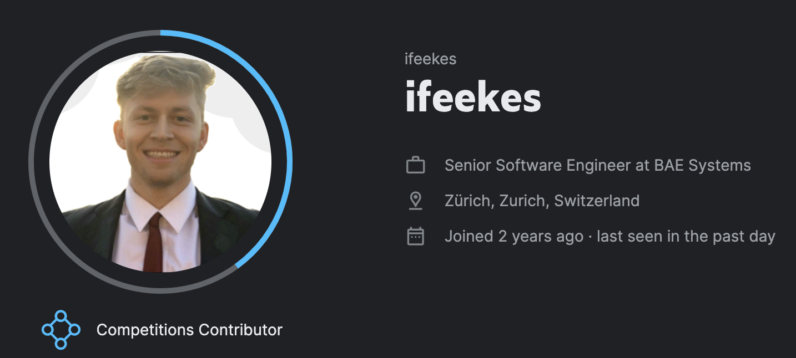

# 🪿 Kaggle
This directory contains projects done through kaggle competitions, playgrounds, and public datasets.

## Profile
My [Kaggle Profile](https://www.kaggle.com/ifeekes) is [ifeekes](https://www.kaggle.com/ifeekes), please feel free to follow or contact me there.


## Directories
### 🦪 Abalone
This was done as part of a [Kaggle Playground Series Competition](https://www.kaggle.com/competitions/playground-series-s4e4) running regression on Abalone Shell Rings (Age) given the difficulty in collecting the ring data in the field.

- **Model**: Gradient Boosting Trees (GBT)
- **Score**: 0.14982 RMSLE, ranked in the top 100
- **Improvements**: Optimize scoring metric, preprocess root of data, focus on underestimations

### 🦾 Steel Plate
This was done as part of a [Kaggle Playground Series Competition](https://www.kaggle.com/c/playground-series-s4e3) to run multicategorical classification to classify the defect type on steel plates. The dataset was particularly unique because the defect categories were not mutually exclusive (e.g. a steel plate could have both a ```K Scratch``` and ```bumps```), so the classification was really for multiple models running binary classification.

- **Model**: GBT
- **Score**: 0.8907 AUC, ranked in the top 50
- **Improvements**: Use more data, generate synthetic data for underrepresented categories

### 🍄 Mushroom Edible or Poisonous
The programming in this directory looks at an [open source dataset from UCI](https://www.kaggle.com/datasets/uciml/mushroom-classification) categorizing various mushrooms as edible or poisionous. While one can use this dataset to create models (especially Random Tree Forests and other hierarchical classifiers) that are extremely highly performant, the most interesting take-aways from the work performed here was in the data analysis.

- **Key Insights**: Some features (e.g., cap diameter) perfectly predict edibility, risking poor generalization
- **Clustering**: Clustering algorithms could improve accuracy by leveraging highly-dimensional data


### 🌸 Petals
The [classic iris dataset](https://scikit-learn.org/stable/auto_examples/datasets/plot_iris_dataset.html) is examined in this notebook. We train a basic logistic regression algorithm to perfectly classify between the three geni of iris, with the help of some feature engineering, such as creating ratios from continuous features.

- **Model**: Logistic Regression
- **Result**: Perfect classification with engineered features

### 📝 MNIST
Another [classic dataset on handwritten digits](https://www.kaggle.com/datasets/hojjatk/mnist-dataset).
You can also download the data with python commands:
```python
from keras.datasets import mnist
```
The work done in this directory is basic deep learning using ANNs to predict digits.

### 🚬 Smoking
This directory explores a [kaggle playground competition](https://www.kaggle.com/datasets/kukuroo3/body-signal-of-smoking).
```sh
kaggle datasets download -d kukuroo3/body-signal-of-smoking
```
The notebook runs a full machine learning pipeline with domain analysis, EDA, feature engineering, building and tuning a neural network, and submissions.

### 🚀 Space Titanic 
Work done in this directory is a part of a [kaggle playground competition](https://www.kaggle.com/competitions/spaceship-titanic) looking at synthetic data determining whether or not someone gets transported to another dimension during the tragedy of the spaceship titanic. The data can also be downloaded with the kaggle command:
```sh
kaggle competitions download -c spaceship-titanic
```
The competition is scored with the **classification accuracy** metric, of which my best submission performs at ```80%``` flat. The notebook runs a full machine learning pipeline, creating a GradientBoostedClassifier to perform predictions and submit the notebook results.

Performance could be improved by $ > 1$ if the notebook were to implement NLP on the passenger names. I see this as less-useful regarding real-world applications and the time it would take me to implement the marginal returns.

### 🚢 Titanic
Models produced in this directory's scripts perform with an ```80%``` **classification accuracy** with regards to predicting whether one will perish in the titanic. These models are trained on [kaggle's titanic dataset](https://www.kaggle.com/competitions/titanic/data) which can also be downloaded via api:
```sh
kaggle competitions download -c titanic
```
Again, the highest contenders among this competition (who aren't hard-coding the actual titanic survirors in their submissions) use NLP on the passengers names, which is not of much statistical value, simply a corner-cut to win marginal performance gains.

### 💨 CO2 Rwanda
This notebook is simply EDA on the CO2 Emissions in Rwanda.